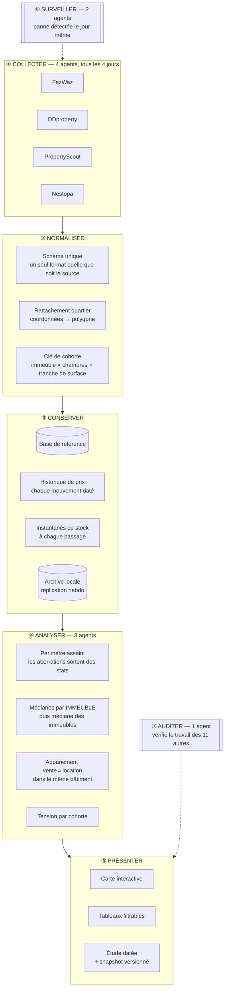

# 01 — Le flux de données

> De la page web publique au chiffre affiché. Cinq étapes, chacune isolée des
> autres. Détail technique : [pipeline.md](../pipeline.md).

## Vue d'ensemble

---

## ① Collecter

Quatre sources publiques, un module d'adaptation par source. Ajouter une
cinquième source, c'est écrire un module — le reste du système ne bouge pas.

La collecte est **volontairement lente** : environ tous les quatre jours, par
catégorie, avec des délais variables entre requêtes. Ce n'est pas une limite
technique, c'est une posture : un scraping agressif se fait bloquer, et une série
statistique interrompue vaut moins qu'une série lente mais continue.

**Ce qui est capturé au-delà du prix** : la géolocalisation précise, la galerie
photo, l'agence et l'agent qui publient, la date de mise en ligne réelle, et
depuis le 2026-07-31 le descriptif rédigé par le vendeur.

## ② Normaliser

Quatre sources écrivent la même réalité de quatre façons. Cette étape produit un
format unique, et surtout **trois identifiants dérivés** qui font tout le reste :

- **L'immeuble**, normalisé pour que « The Line Asoke », « the-line-asoke » et
  « The Line Asoke-Ratchada » désignent le même bâtiment.
- **Le quartier**, calculé depuis les coordonnées par appartenance à un polygone —
  pas depuis le texte de l'annonce, qui ment souvent.
- **La cohorte** : immeuble × nombre de chambres × tranche de 5 m² × type de
  transaction. C'est cette clé qui permet de suivre un *type de lot* dans le temps
  même quand les annonces individuelles disparaissent et reparaissent.

## ③ Conserver

Une annonce qui disparaît **n'est jamais supprimée** : elle passe en inactif avec
sa date. C'est ce qui permet de mesurer l'écoulement du stock plutôt que
l'instantané.

Trois séries s'accumulent à chaque passage : l'historique des prix (36 505
observations, dont 736 mouvements réels d'amplitude moyenne 8,9 %), les
instantanés de stock par cohorte (80 126 observations sur 9 385 cohortes), et les
délistages datés.

Le serveur ne garde qu'une fenêtre chaude ; une **archive locale complète** est
répliquée chaque semaine, et rien n'est purgé du serveur sans que la copie ait été
vérifiée ligne à ligne.

## ④ Analyser

Trois partis pris, détaillés en [02](02-methode-et-differenciation.md) :

1. **Un périmètre de plausibilité unique.** Un bien hors bornes n'est pas « pas
   cher », c'est une donnée à écarter. Les bornes sont définies à un seul endroit
   et appliquées partout — un agent vérifie à chaque cycle que les deux
   implémentations (application et base) disent la même chose.
2. **L'immeuble comme unité.** On calcule d'abord une médiane par immeuble, puis
   la médiane des immeubles. Un immeuble = une voix.
3. **Le rendement dans le même bâtiment.** Loyer et prix du **même** immeuble,
   jamais un ratio entre deux médianes qui ne décrivent pas le même parc.

## ⑤ Présenter

Trois sorties du même socle : une carte interactive, des tableaux filtrables, et
une **étude datée** qui fige un instantané versionné. Les paramètres de calcul
sont gelés dans un fichier de configuration numéroté : changer un seuil oblige à
incrémenter la version, ce qui rend visible toute rupture de série.

## ⑥ Surveiller — et pourquoi c'est une étape, pas un détail

Le 2026-07-23, un site a changé la structure de ses pages. Le collecteur a
continué de tourner, sans erreur, en ramenant **zéro annonce**. Le défaut a couru
plusieurs jours avant d'être vu à l'œil nu.

C'est le mode de panne le plus dangereux d'un système de données : il ne fait pas
de bruit, et une série qui s'arrête ressemble à un marché calme. Un agent compare
désormais chaque passage à l'historique de la même source ; la signature
« volume effondré **sans** erreur réseau » déclenche une alerte le jour même.

## ⑦ Auditer

Un dernier agent relit le journal d'exécution du cycle et vérifie que chaque agent
a produit ce qu'il avait déclaré devoir produire. Il écrit un compte rendu en
français lisible. **Un agent silencieux y est traité comme plus grave qu'un agent
en erreur** — c'est le silence, pas l'erreur, qui a laissé trois tâches planifiées
inopérantes pendant trois semaines sans que personne le remarque.
