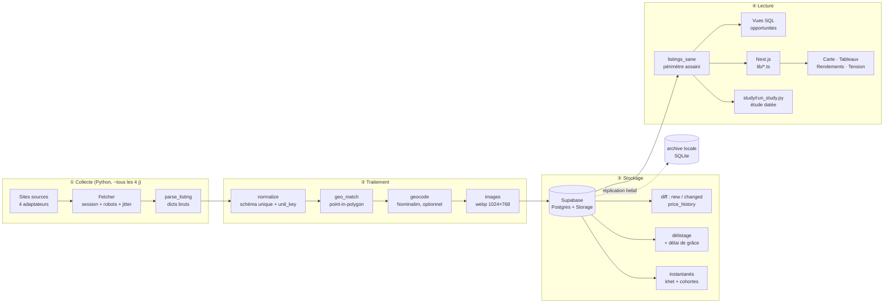
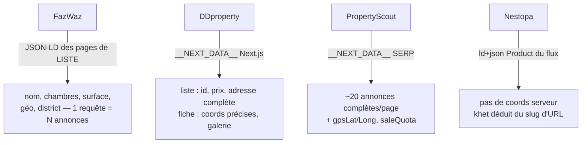
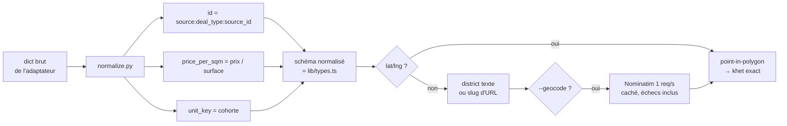
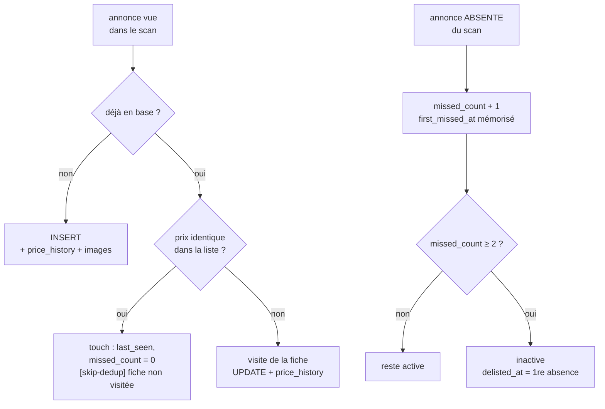
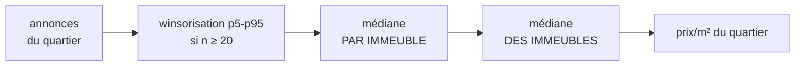
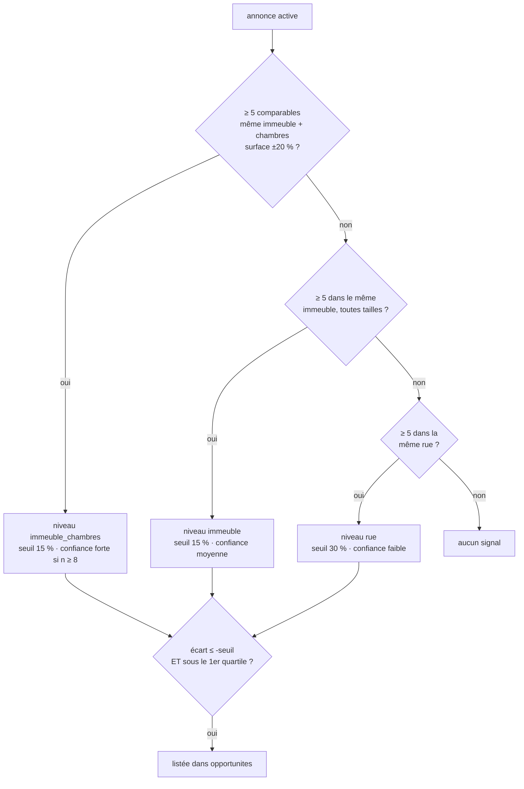

# Pipeline Lowi BKK — du scrap au chiffre affiché

> Carte du système de bout en bout : comment la donnée est collectée, parsée,
> normalisée, stockée, puis transformée en statistique. Pour le *pourquoi* de
> chaque choix et l'historique des défauts corrigés, voir
> [journal-technique.md](journal-technique.md).
>
> État au 2026-07-28 : 34 275 annonces, 16 147 actives, 4 sources.

---

## 1. Vue d'ensemble



**Deux backends, une seule interface.** `SqliteStore` (local) et `SupabaseStore`
(en ligne) implémentent `BaseStore` : le pipeline ne sait pas où il écrit.
Symétriquement, `lib/listings-db.ts` lit Supabase si `SUPABASE_DB_URL` est
défini, sinon le SQLite local — l'UI ne change pas.

---

## 2. Collecte — méthode de scrap

### Posture

Usage personnel non commercial, cadence d'environ 4 jours par catégorie, jamais
de boucle serrée, `robots.txt` respecté, aucune redistribution. Le risque ToS est
assumé et documenté.

### La couche HTTP (`scraper/pipeline/fetch.py`)

Une **seule session persistante** par run, avec des en-têtes de navigateur
réalistes. Trois problèmes concrets qu'elle résout :

| Problème | Réponse |
|---|---|
| Challenge Cloudflare sur les fiches DDproperty | Parcourir la **liste d'abord** réchauffe le cookie `__cf_bm` ; les fiches passent ensuite sans Chrome |
| `robots.txt` servi comme un challenge → parsé comme « tout interdit » | Récupéré via *notre* session ; si illisible, accès autorisé par défaut (RFC) |
| Cadence trop régulière = signature de robot | **Jitter** : délai × (1 + aléa 0-80 %), plus une pause longue (4-9 s) sur ~1 requête sur 25. Jamais plus rapide que le débit configuré |

Brotli est volontairement absent des en-têtes : `requests` ne le décode pas.

### Les 4 adaptateurs — ce qu'on lit, et où



Aucun sélecteur en dur dans le code : URLs, pagination, rate-limit et options
vivent dans `scraper/config/<site>.json`. Un scrap ciblé se lance avec
`--config config/targets/<x>.json` — **jamais avec `--full`**, un scan partiel ne
doit pas pouvoir délister.

### Filtrage à la source

- **Freehold uniquement** — le leasehold est écarté par l'adaptateur, pas en aval
  (DDproperty : `tenureCode='F'`).
- **Exclusions par nom** — `config/exclude.json`, appliqué deux fois : sur le stub
  de liste, puis sur la fiche une fois le vrai nom d'immeuble connu.
- **Quota** (`foreigner` / `thai`) extrait quand la source l'expose. En pratique
  **1,2 % des annonces seulement** — c'est le trou de données le plus gênant.

---

## 3. Parsing et normalisation



**`id = source:deal_type:source_id`** — le `deal_type` est dans l'identifiant à
dessein : une même unité peut être listée en vente **et** en location, et il faut
les deux lignes pour calculer un rendement.

**`unit_key` = la cohorte** : `immeuble normalisé | chambres | tranche de 5 m² |
type`. C'est l'unité d'analyse qui remplace l'annonce, parce que les agents
suppriment et republient massivement (7 470 paires « disparue → identique
réapparue » dans l'archive, dont 3 015 en moins de 7 jours). Un repost retombe
dans la même cohorte, donc le stock ne bouge pas : correctement lu comme « aucune
absorption ».

> ⚠ Une cohorte peut contenir plusieurs lots réellement distincts (dix 45 m²
> identiques dans une tour). Ce n'est **pas** un compteur de biens uniques.

**Arrondi de la tranche** : `floor(x/5 + 0.5) × 5`, convention SQL — Python
arrondit au pair par défaut (`round(8.5) == 8`) et produisait des cohortes
scindées pour un même lot.

**Images** : téléchargées, recadrées en cover centré, converties en webp
1024×768, uploadées dans Supabase Storage. Chemin identique en local et en ligne.

---

## 4. Stockage, diff et délistage



**Le délai de grâce** existe parce qu'un scan `--full` s'arrête à `max_pages` :
toute la queue de liste était marquée disparue à tort, puis réactivée au scan
suivant. La durée de vie mesurée valait **4,7 jours médians pour toutes les
strates** — la cadence de scan, pas le marché. `delisted_at` est daté de la
*première* absence, sinon la durée de vie serait surestimée d'un cycle.

**Garde-fou anti-accident** : si un scan `--full` voit moins de 50 % des actives
en base pour son périmètre, le délistage est **annulé** (site en panne, pagination
cassée, blocage). Une erreur isolée sur une annonce ne tue pas le run : elle est
loguée, l'annonce est retirée de `seen_ids` pour ne pas être délistée à tort.

**Instantanés, en fin de chaque run** — c'est ce qui fabrique la dimension
temporelle :

- `khet_snapshots` : par quartier × type — nombre d'actives, prix/m² moyen **et
  médian**.
- `cohort_snapshots` : stock actif par `unit_key`, avec médiane, min, max.
  Insensible aux republications, c'est la série destinée à remplacer l'absorption.

**Archivage** : `ops/sync_supabase_local.py` réplique toutes les tables dans
`archive/lowi-archive.db`, puis `--prune` supprime du serveur les inactives de
plus de 90 jours **uniquement si leur copie est vérifiée id par id**. Le local est
la référence historique complète, le serveur une fenêtre chaude.

---

## 5. Heuristiques

| Heuristique | Où | Principe | État |
|---|---|---|---|
| **Dédup incrémentale** | `run.py` | Prix inchangé lu dans la liste → fiche non re-visitée. Raccourcit fortement les scraps | actif |
| **Matching khet** | `geo_match.py` | Ray casting contre le GeoJSON des 50 khets ; repli sur le district texte | actif |
| **Géocodage** | `geocode.py` | Nominatim 1 req/s, cache disque incluant les échecs. Ne remplit que le manquant, n'écrase jamais des coords précises. Taux de succès 35-40 % sur les noms thaïs | à la demande |
| **Cohorte** | `normalize.py` | Immeuble × chambres × tranche × type | actif |
| **Empreinte photo** | `photo_sig.py` | Poids des fichiers par requête HEAD (aucun octet transféré) : un agent qui republie réutilise les mêmes fichiers | ⚠ **inerte** — 0 ligne en base, `est_doublon()` sans appelant |
| **Recoupement vente↔location** | `cross-match.ts` | Même immeuble + khet + chambres, surface ±7 % → rendement annuel réel | actif |
| **Proximité** | `proximity.ts` | Écoles / métro / bus / CBD depuis les POI, calculé côté client | actif |

---

## 6. Méthodes de calcul

### 6.1 Le périmètre, d'abord

Toute statistique se calcule sur les annonces **plausibles** :
`lib/market-bounds.ts` côté TS, vue `listings_sane` côté SQL — vente
800 k–100 M, loyer 3 k–500 k, surface 15–500 m². Les deux doivent rester alignés.
Sans ce filtre, les « meilleures affaires » étaient des locations mal classées en
vente à −100 %.

### 6.2 Prix/m² par quartier — double médiane (`lib/yields.ts`)



On ne connaît ni l'année de construction, ni l'étage, ni la vue. **L'immeuble
encapsule tout cela** : on agrège donc par immeuble d'abord, ce qui écrase le
bruit intra-immeuble, puis entre immeubles — **1 immeuble = 1 voix**, pour qu'une
tour à 80 annonces ne pèse pas 80 fois une tour à 1 annonce.

### 6.3 Rendement — within-condo

Le rendement se calcule **dans le même immeuble** : loyer/m² médian × 12 ÷
prix/m² médian *du même bâtiment*. L'âge, le standing et l'emplacement se
simplifient dans la division. On prend ensuite la médiane de ces rendements.
En dessous de 5 immeubles appariés, repli sur le ratio des médianes du quartier,
**marqué `†`**. 81 % du stock actif est dans des immeubles ayant vente et
location — c'est ce qui rend la méthode praticable.

Strate **0–1BR par défaut** : comparer les quartiers à panier constant, sans biais
de mix penthouse.

### 6.4 Tension par quartier (`lib/tension.ts`)

Indice composite 0–100, chaque composante normalisée en **rang centile** entre
quartiers :

| Composante | Poids | Lecture |
|---|---|---|
| Absorption | 35 | Time-on-market des disparues ; à défaut, âge des actives. Court = tendu |
| **Pression vendeuse** | 25 | Actives ÷ immeubles **ayant au moins une active**. Beaucoup de vendeurs dans les mêmes tours = marché **mou** |
| Tendance stock | 20 | Pente du nombre d'actives. En baisse = tendu |
| Momentum prix | 20 | Pente de la **médiane** du prix/m². En hausse = tendu |

Trois garde-fous :

1. **Rétrécissement** vers la médiane du marché, poids `n/(n+20)` — à 5 annonces
   un quartier ne compte que pour 20 % de son propre score.
2. **Seuil de publication à 10 annonces** — en dessous, `null`. « Données
   insuffisantes » vaut mieux qu'un chiffre ininterprétable. 19 à 22 quartiers
   sur 57 y tombent.
3. **Historique de délistage filtré** — seules les disparitions postérieures au
   correctif du 2026-07-28 comptent ; les précédentes mesuraient la cadence de
   scan.

> **Limite mesurée, à garder en tête** : la pression vendeuse conserve `r = 0,55`
> de corrélation avec la taille du marché (contre −1 par construction pour
> l'ancienne « rareté »). Le défaut est fortement atténué, pas éliminé. Le
> substitut correct est la série `cohort_snapshots`, qui n'a encore qu'un seul
> relevé. **Lire l'indice comme un classement relatif grossier, pas une mesure.**

### 6.5 Écarts de prix — cascade de comparaison (`opportunites`)



Dispersion mesurée du prix/m² (écart p25-p75, juillet 2026) — c'est elle qui
dicte la conception :

| Périmètre | Dispersion | Groupes |
|---|---|---|
| Même immeuble + mêmes chambres | 14,9 % | 383 |
| Même immeuble, toutes tailles | 16,5 % | 493 |
| Même khet | **52,2 %** | 30 |

Deux enseignements : ce qui explique le prix c'est le **bâtiment**, pas la taille
du lot (quitter l'immeuble triple le bruit, élargir les tailles ne coûte que
1,6 point) ; et à 52 % de dispersion, la moitié d'un quartier est mécaniquement
« à −15 % », donc **le niveau khet ne déclenche aucun signal** — il reste du
contexte. L'annonce évaluée est toujours exclue de sa propre référence.

> Un écart n'est pas une opportunité. Il faut vérifier étage, vue, état et quota.
> Le niveau et la confiance s'affichent **toujours** à côté du pourcentage.

### 6.6 Bonnes affaires (`lib/deals.ts`)

Pour chaque bien en vente : **décote marché** (sous la baseline du couple
quartier × tranche de chambres), **décote temporelle** (baisse depuis le premier
relevé, via `price_history`) et **rendement estimé** (loyer médian comparable).
Baseline = moyenne des 10 valeurs médianes — plus stable qu'un point médian isolé
tout en restant insensible aux extrêmes.

---

## 7. Doctrine de présentation

Le produit sert deux usages opposés : outil de décision personnel (assumé,
orienté) et veille potentiellement vendable (neutre, auditable). **Règle :
séparer la couche de mesure de la couche de jugement.**

1. Jamais une médiane sans son `n` ni sa dispersion.
2. Toute comparaison est explicitement *à périmètre comparable*, et le périmètre
   est affiché.
3. Distinguer visuellement **mesuré** et **estimé** (le repli `†`).
4. Aucun classement sans exposer les poids qui le produisent.
5. Une anomalie s'annonce « à vérifier », jamais « opportunité ».
6. Afficher la date de dernière mise à jour sur chaque vue.

---

## 8. Où changer quoi

| Besoin | Fichier |
|---|---|
| Variables de scrap d'un site | `scraper/config/<site>.json` |
| Ajouter un site | `scraper/adapters/<site>.py` + sa config |
| Bornes de plausibilité | `lib/market-bounds.ts` **et** `supabase/migrations/plausibilite.sql` |
| Poids / seuils de la tension | `lib/tension.ts` (`WEIGHTS`, `MIN_ACTIVE_TO_PUBLISH`, `SHRINK_K`) |
| Méthode des rendements | `lib/yields.ts` |
| Seuils de la cascade d'écarts | `supabase/migrations/plausibilite.sql` |
| Présentation d'une fiche | `config/property-card.config.ts` |
| Couleurs / thème | `config/theme.ts`, `config/map-style.json` |
| Paramètres de l'étude | `study/config.json` (incrémenter `config_version`) |

## 9. Vérifications

```bash
npm test && npm run typecheck && npm run build
```

---

## 10. Ce qui est faux ou absent aujourd'hui

- **`year_built` : 0 sur 4 514 immeubles.** La donnée la plus structurante pour
  une stratégie à 5-10 ans (la dépréciation d'un condo thaï est raide sur la
  première décennie) est vide côté serveur.
- **Quota étranger : 1,2 % des annonces.** Critère éliminatoire pour un acheteur
  étranger.
- **1 399 doublons actifs** (8,7 %), dont 1 326 intra-source, jusqu'à 28 fois le
  même lot. Gonfle la pression vendeuse.
- **Charges de copropriété jamais scrapées** — 40-70 THB/m²/mois, soit environ un
  point de rendement. Tous les rendements affichés sont **bruts**.
- **Étage, vue, orientation absents** — ils expliquent l'essentiel de la
  dispersion intra-immeuble que la cascade attribue à une décote.
- **Prix affichés, pas transactionnels.** La bonne lecture est le classement
  relatif et le mouvement dans le temps, jamais le niveau absolu.
- **Logique métier dupliquée** entre `study/run_study.py` (Python) et
  `lib/yields.ts` (TypeScript) : deux implémentations, deux vérités possibles.
