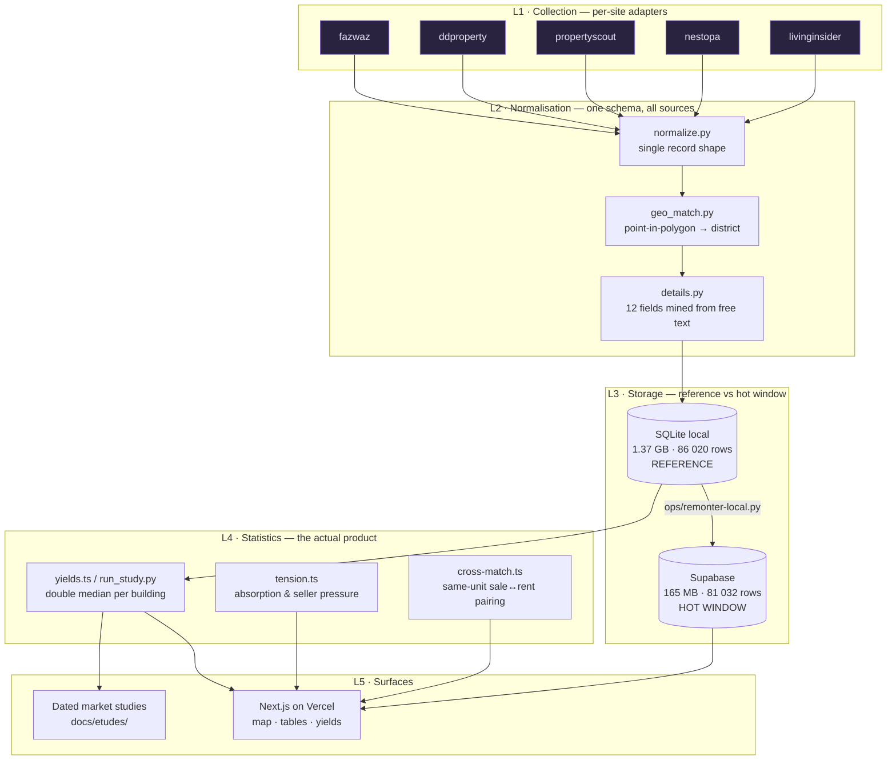
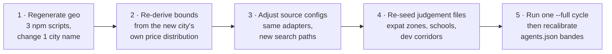
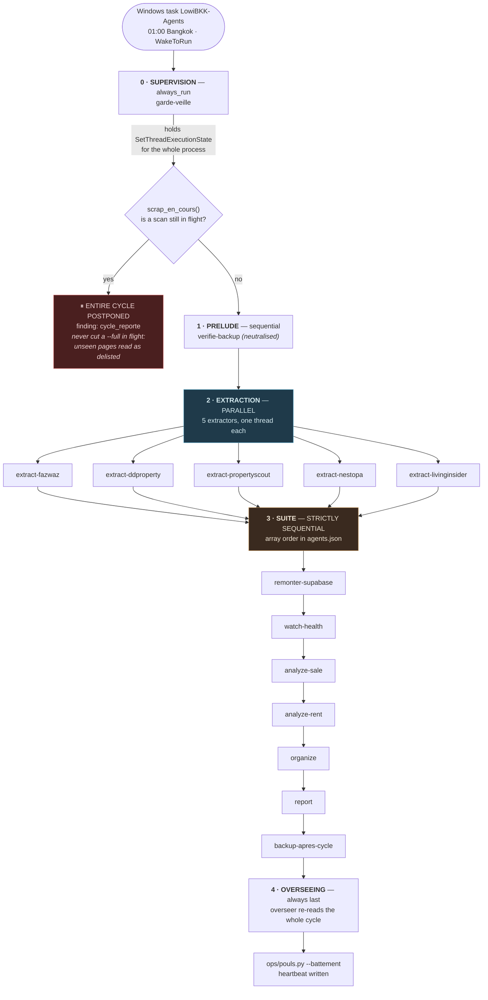
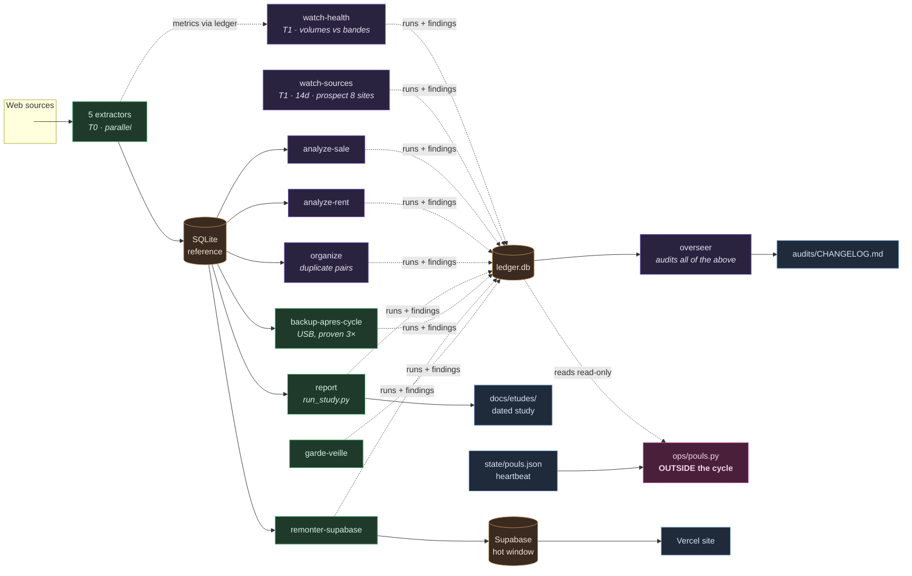
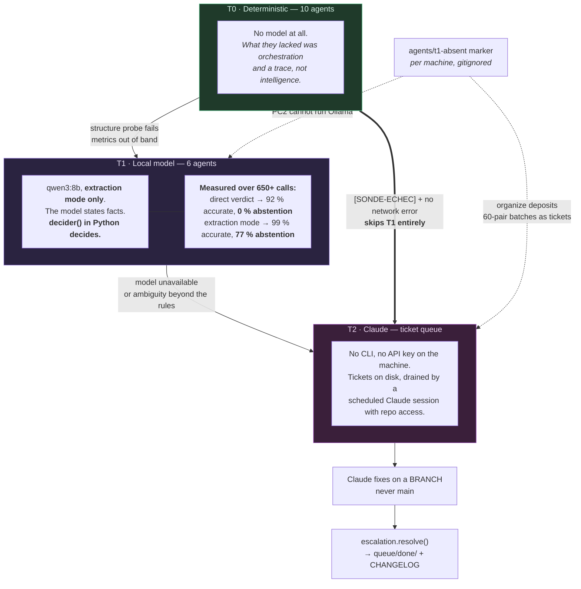
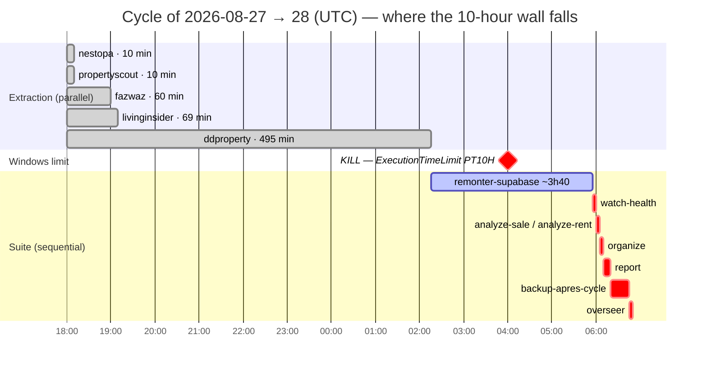

# LOWI — Replication Blueprint, Modularity Verification & Security Audit

> **Purpose.** This document is written so that someone who has never seen this
> repository can rebuild the same system for a different city, a different
> country, and a different language — and so that the person who *did* build it
> can see, in one place, what is solid, what is load-bearing but undocumented,
> and what is currently broken.
>
> **Audit date:** 2026-08-28. Every figure below was measured on that date
> against the live systems, not copied from existing documentation. Where a
> figure contradicts `CLAUDE.md`, the measurement wins and the discrepancy is
> named.
>
> **Language.** This file is in English by request. The codebase itself is in
> French and stays that way — see [§7.3](#73-the-language-of-the-code-itself).

---

## Provenance convention

The pitch deck already uses provenance stamps. This document reuses them, because
the single most expensive class of error in this project's history was mistaking
one for another — seven times in August 2026 it was the *measurement*, not the
measured system, that was wrong.

| Stamp | Meaning |
|---|---|
| **[M]** | **Measured** on 2026-08-28 against the live system. Reproducible — the command is in [Appendix A](#appendix-a--measurement-log). |
| **[I]** | **Inferred** — a reading of measured facts, stated as reasoning. |
| **[O]** | **Open** — a decision that has not been taken. Not a defect; an unresolved choice. |
| **[D]** | **Defect** — something that does not do what it claims. |

---

# Table of contents

1. [What the system actually is](#1-what-the-system-actually-is)
2. [Replication blueprint — porting to another city, country, language](#2-replication-blueprint)
3. [The agent system, reproduced](#3-the-agent-system-reproduced)
4. [Modularity verification](#4-modularity-verification)
5. [Security audit](#5-security-audit)
6. [What is missing, incomplete, or wrong](#6-what-is-missing-incomplete-or-wrong)
7. [Code commentary, conventions, and the language question](#7-code-commentary-conventions-and-the-language-question)
- [Appendix A — Measurement log](#appendix-a--measurement-log)
- [Appendix B — Tooling installed during this audit](#appendix-b--tooling-installed-during-this-audit)

---

# 1. What the system actually is

Strip away the Bangkok specifics and this is a **five-layer market-observation
machine**. Understanding the layer boundaries is the whole of the porting story,
because three of the five layers are already geography-neutral.



**Which layers are already portable, measured against the code:**

| Layer | Portable as-is? | Why |
|---|---|---|
| **L1 Collection** | **Yes, by design** [M] | `BaseAdapter` has exactly two required methods. `Fetcher` is the most-connected node in the whole codebase (60 edges) yet knows nothing about Thailand. |
| **L2 Normalisation** | **Mostly** [M] | The record shape is currency- and country-neutral. Two exceptions: `khet`/`khwaeng` are Thai words baked into column names, and `details.py` mines Thai/English prose. |
| **L3 Storage** | **Yes** [M] | `BaseStore` is a 12-method ABC with two working implementations. Swapping engines is already proven — it was done on 2026-08-25. |
| **L4 Statistics** | **Yes in method, no in code** [D] | The *method* (double median per building, within-building yield) is geography-neutral and is the real intellectual asset. The *code* is duplicated across TypeScript and Python and one copy is ASCII-only. See [§2.4](#24-language--the-ascii-trap). |
| **L5 Surfaces** | **Yes, with a data swap** [M] | The map reads one GeoJSON of administrative polygons and one of POIs. Both are generated by scripts, not hand-drawn. |

**[I] The conclusion that matters for replication:** the expensive part of this
system is not the code, it is the *accumulated corrections*. 1.37 GB of history,
a labelled test set of 120 duplicate pairs, seven measured guard-rail failures,
and a normalisation convention that had to be reverse-engineered from SQL's
rounding behaviour. A clean-room rebuild in a new city reproduces the code in
weeks and the corrections in months.

---

# 2. Replication blueprint

## 2.1 The porting inventory

Every file in the repository falls into one of four buckets. This table is the
core of the replication story: **generic** files are copied untouched,
**parameterised** files need a constant changed, **regenerated** files are
produced by an existing script, and **rewrite** files carry real local knowledge.

### Copy untouched — no change of any kind [M]

| File | Why it is generic |
|---|---|
| `scraper/adapters/base.py` | Two abstract methods + a structure probe. Nothing site-specific. |
| `scraper/pipeline/fetch.py` | HTTP session, rate limit, robots.txt, Cloudflare warm-up. |
| `scraper/pipeline/images.py`, `storage.py`, `photo_sig.py` | Resize/upload/fingerprint. |
| `scraper/store/base.py` | The storage contract, minus the column list. |
| `scraper/store/sqlite_store.py`, `supabase_store.py` | Engine mechanics. |
| `agents/core/*` (11 modules) | Ledger, escalation, shell, alerting, metrics, wake-lock. **The entire orchestration substrate is domain-free.** |
| `agents/orchestrator.py` | Reads a JSON registry. Knows no site names. |
| `ops/pouls.py` | The out-of-cycle watchdog. |
| `lib/cache.ts`, `lib/filters.ts`, `lib/auth.ts` | Memoisation, filter algebra, gate. |

**[M] Measured share:** of 15 441 lines of first-party code, roughly **6 900 lines
(45 %)** sit in this bucket. That is the real portability number.

### Change a constant — parameterised [M]

| File | The constant | Today | For a new market |
|---|---|---|---|
| `scripts/fetch-khet-geojson.ts:23` | `["name:en"="Bangkok"]` + `KHET_ADMIN_LEVEL=6` | Bangkok, level 6 | City name + the OSM admin level that means "district" in that country. **These differ per country** — level 6 in Thailand, 8 in France, 9 in Japan. |
| `scripts/fetch-pois.ts:26` | same area clause | Bangkok | Same. |
| `config/map-config.ts` | `INITIAL_VIEW`, `MAX_BOUNDS` | `[100.523, 13.736]`, z10.2 | Centre + bounds of the new city. |
| `lib/proximity.ts:9` | `CBD` | `[100.534, 13.724]` (Sathorn/Silom) | The new city's business core. |
| `lib/market-bounds.ts` | 6 plausibility bounds | 800 k–100 M sale, 3 k–500 k rent, 15–500 m² | **Must be re-derived from the new market's own distribution, never converted by exchange rate.** |
| `scraper/pipeline/normalize.py:41` | `AREA_BUCKET = 5` | 5 m² | Keep 5 m² for metric markets; a ft² market needs its own bucket and its own rounding proof. |
| `scraper/config/*.json` | Every scraping variable | 5 files | One JSON per new source. |

### Regenerate with an existing script — no code written [M]

| Artifact | Command | Size today |
|---|---|---|
| `public/data/bangkok-khet.geojson` | `npm run geo:khet` | 334 KB, 50 districts |
| `public/data/pois.geojson` | `npm run geo:pois` | 221 KB |
| `public/data/corridors.geojson` | `npm run geo:corridors` | 136 KB |

### Rewrite — this is where the local knowledge lives [M]

| File / artifact | What it encodes | Effort |
|---|---|---|
| `scraper/adapters/<site>.py` × N | How each portal serves its data (JSON-LD, `__NEXT_DATA__`, server HTML) | **~250 lines per source.** The five existing ones average 253 lines. |
| `scraper/pipeline/details.py` | 12 fields mined from listing prose, with per-language patterns | Highest-friction item. See [§2.4](#24-language--the-ascii-trap). |
| `data/intl-schools-seed.json` | Schools OSM tags badly or not at all | Manual, ~20 entries |
| `data/expat-zones-seed.json`, `dev-zones-seed.json` | Where foreigners live, which redevelopment is *acted* vs *announced* | **Pure local judgement. Not derivable from any dataset.** |
| Legal filters (freehold-only, foreigner/Thai quota) | Thai condominium law, 49 % foreign quota | **Country-specific law, not a config value.** |

## 2.2 Porting to another city, same country

The cheapest case. Bangkok → Chiang Mai or Phuket.



**[M] What does not change:** the adapters, the whole agent system, the storage
layer, the statistics method, the UI. **[I] Estimated effort: days, not weeks** —
because the five portals already cover the whole country, only their search paths
change.

**[D] One blocker, measured.** `study/run_study.py` reads
`KHETS_BKK` from `public/data/bangkok-khet.geojson` by **filename**, and the
column is called `khet` in every table, every view, and every TypeScript type.
Porting to a second city inside the same deployment is not possible without a
`city` dimension that does not exist. Two cities today means two deployments.

## 2.3 Porting to another country

Four things change that a city move does not touch.

**1. Currency.** [D] `currency` exists as a column and is written on every row —
but it is **read nowhere**. Every display path assumes THB: `lib/types.ts`,
`config/property-card.config.ts`, `components/ListingsTable.tsx`,
`components/MapFilterBand.tsx` and `lib/deals.ts` all format with a hard-coded
symbol. Making the system multi-currency is a display refactor, not a schema
one — the schema already anticipated it.

**2. Administrative geography.** The Thai two-level `khet` (district) /
`khwaeng` (sub-district) split is baked into column names across SQLite,
Postgres, 13 views, `lib/types.ts` and every component. **[I] Recommendation for
a new build: name these `admin_l1` / `admin_l2` from day one and carry a display
label in config.** Renaming them in *this* codebase is a wide, low-value change —
do it only if a second country is actually committed to.

**3. Ownership law.** `tenure` (freehold-only) and `quota` (foreigner/Thai) are
Thai condominium law. Every country has a different constraint — or none. These
are filters applied *at collection*, which is the right place: the alternative
is a database full of stock you can never buy. **[M] But see the measured
finding in [§6](#6-what-is-missing-incomplete-or-wrong): `quota` is populated on
172 of 61 246 active listings — 0.28 % — while the UI exposes it as a filter.**

**4. Transaction transparency.** The entire statistical method exists *because*
Thailand has no public transaction registry — the system infers transactions
from delisting, which is why cohorts, `unit_key`, and the repost-detection
machinery exist at all. **[I] In a country with a public registry (France's DVF,
the UK's Land Registry), most of `tension.ts` and the cohort machinery becomes
unnecessary — you would read transactions instead of inferring them.** That is
the single largest simplification available on a port, and it is worth checking
before rebuilding.

## 2.4 Language — the ASCII trap

This is the sharpest portability finding in the audit, and it is measured.

**There are three independent implementations of "normalise a building name",
and they disagree.** [M]

| Implementation | Rule | Behaviour on non-Latin text |
|---|---|---|
| `lib/condo-name.ts:25` | `replace(/[^a-z0-9 ]/g, "")` | **Deletes every non-ASCII character.** A fully Thai name normalises to the empty string. |
| `study/run_study.py:106` | `ch.isalnum()` | Python's `isalnum()` is Unicode-aware → **keeps Thai, Cyrillic, CJK**. |
| `scraper/pipeline/normalize.py:64` | strips stop-words, `[^\w\s]` with `re.UNICODE` | Keeps Thai **and** removes `bangkok`/`condo`/`project`/`residence`. |

**[M] Measured impact today, on the live reference database:**

- **21 distinct buildings / 25 active listings** normalise to the **empty string**
  under the TypeScript rule. They are silently merged into a single phantom
  "building" that feeds the double-median statistic.
- **173 distinct buildings / 499 active listings** contain at least one non-ASCII
  character (Thai script, `฿`, en-dashes) and are mangled **differently** by each
  of the three implementations.

**[I] Why this matters far more for a port than it does today.** In Bangkok the
portals publish romanised names, so the damage is 25 listings. In a market whose
portals publish in the local script — Japan, Korea, Taiwan, or LivingInsider's
Thai-language flow as it grows — the *same code* collapses the entire building
dimension to one empty key. The double-median-per-building method, which is the
project's core statistical claim, would return a single meaningless number and
**would not raise an error**.

**[I] Recommended fix, in order of value:**

1. Make `lib/condo-name.ts` Unicode-aware (`/[^\p{L}\p{N} ]/gu` with the `u`
   flag). One line. Do it before any port.
2. Add an assertion in the statistics path: if more than *n* listings share the
   empty normalised key, that is a defect, not a building.
3. Collapse the three implementations to one. The existing comment in
   `lib/condo-name.ts` already documents the divergence as deliberate and warns
   against comparing a TS grouping to a `unit_key` — that warning is correct, and
   it is also an admission that the same concept has three definitions.

**Beyond names**, `scraper/pipeline/details.py` mines 12 fields from listing
prose using per-language patterns. It is the file with the largest per-market
rewrite cost, and there is no way around it: a listing description is the least
structured, most local artifact in the pipeline.

## 2.5 What must not be copied

**[M] Three artifacts in this repository are correct for *this* deployment and
would be actively wrong in a copy:**

1. **`agents/agents.json` cadences and `bandes`.** Every band was calibrated
   against measured volumes on these five sources. `extract-nestopa`'s band was
   deliberately lowered to `[0, 60]` because that source is frozen to one page —
   copied to a new market, it would either scream constantly or never.
2. **`agents/tests/pairs.json`** — 120 hand-labelled duplicate pairs, plus a
   documented correction where 10 labels were wrong and the model was right. This
   is a Bangkok-specific ground truth. Copy the *harness*, rebuild the *labels*.
3. **`ops/install-agents-task.ps1` and everything Windows.** See
   [§3.5](#35-porting-the-orchestrator-off-windows).

---

# 3. The agent system, reproduced

## 3.1 The registry contract — the one thing to copy exactly

The entire agent system is one JSON file plus a runner. **[M] `agents.json`
declares 18 agents; 15 are in an execution lane and 3 are deliberately
neutralised** (`lanes: []` = manual invocation only).

An agent is a dictionary with these keys. This is the complete contract — a new
implementation that honours it inherits the whole orchestrator for free.

| Key | Meaning | Required |
|---|---|---|
| `name` | Unique id. Also the ledger key and the `skills/<name>/` folder name. | yes |
| `famille` | Execution phase. **The phase names control concurrency** — see 3.2. | yes |
| `tier` | `T0` deterministic · `T1` local model · `T2` escalated to Claude | yes |
| `lanes` | `["daily"]`, `["weekly"]`, both, or `[]` for neutralised | yes |
| `every_days` | Cadence in **calendar days, local timezone** | default 1 |
| `cmd` / `module` | A subprocess command (`@py` = the venv python) **or** a Python module exposing `run()` | one of |
| `then` | Extra commands chained after `cmd`, **each runs even if the previous failed** | no |
| `after` | Documentation of ordering intent | no |
| `requires_healthy` | Refuse to run unless these agents' last run was `ok`. Guards destructive work. | no |
| `always_run` | Ignore the cadence filter — for agents acting on *this* process | no |
| `needs_supabase` | Skip in `--local` test mode | no |
| `bandes` | Expected metric ranges. `watch-health` alerts outside them. | no |
| `_pourquoi`, `_*` | Keys starting with `_` are documentation. **A fifth of this file is prose, deliberately.** | no |

**[I] The design decision worth stealing:** ordering is *not* a field. The
execution order of the post-extraction phase is the array order in
`agents.json`. That is unusual and it is documented as such — inserting
`remonter-supabase` before `watch-health` in the array is what places it first in
the sequence. It is terse and it works, but it is also invisible: nothing in the
file says "order matters here", and nothing tests it.

## 3.2 How a cycle actually executes

This is the diagram that was missing. The orchestrator does **not** simply walk
the list — it runs five phases with different concurrency rules, and two of the
phases exist purely to prevent a class of failure that actually happened.



**Why each phase boundary exists — all four are corrections of real incidents:**

| Boundary | The incident it prevents |
|---|---|
| Supervision before everything | `extract-ddproperty` killed by modern standby on two consecutive cycles (2026-08-16). `powercfg /requests` was empty at the time of the observation — the wake-lock has to be held by *this* process. |
| `scrap_en_cours()` gate | Moving the cadence to calendar days (2026-08-25) made everything due at 01:00 even when yesterday's cycle was still running. A `--full` cut in flight delists everything it did not reach. |
| Extraction parallel | Five different domains, rate limit is per-`Fetcher` hence per-source. Cycle time dropped from 31 h to ~16 h. |
| Suite sequential | Every agent in the suite reads state the extractors wrote. |

## 3.3 Who depends on whom



**[I] The structural insight, and the one to carry to any replication:**
`ops/pouls.py` is drawn outside every box on purpose. `watch-health` and
`overseer` are *agents* — they run inside the cycle. **A cycle that never starts
never runs its own watchdogs.** On 24 and 25 August 2026 nothing was scraped for
two nights and nothing signalled it; it took reading the Windows event log to
notice. Any reproduction of this architecture needs at least one observer whose
liveness does not depend on the thing it observes.

## 3.4 The three tiers and the escalation loop



**[I] Three findings from this design that generalise beyond real estate:**

1. **Never ask a small model for a verdict.** Asked to judge, it judges — every
   time, including when the question is undecidable. 0 % abstention. Asked to
   *state facts* and letting deterministic code decide gave 99 % accuracy and
   77 % abstention on the same pairs. This is the single most transferable result
   in the repository.
2. **Self-reported confidence is not a threshold.** qwen2.5 returned
   `confidence: 0.9` on answers that were wrong.
3. **An absent capability must be *declared*, not detected as a failure.** The
   `agents/t1-absent` marker exists because without it `ask_safe` logged up to
   six high-severity findings per cycle, every day, forever — a guard-rail that
   cries wolf teaches you to ignore alerts.

## 3.5 Porting the orchestrator off Windows

**[M] The domain logic is OS-free. The scheduling and power management are not.**

| Windows dependency | Where | Linux/macOS equivalent |
|---|---|---|
| Task Scheduler + `WakeToRun` | `ops/install-agents-task.ps1` | `systemd` timer + `rtcwake`, or a cron with an RTC alarm |
| `ExecutionTimeLimit` | task XML | `systemd` `RuntimeMaxSec=` — **and note the defect in [§6](#6-what-is-missing-incomplete-or-wrong)** |
| `SetThreadExecutionState` | `agents/core/wake_lock.py` | `systemd-inhibit` / `caffeinate` |
| `Get-CimInstance Win32_Process` | `orchestrator.py:scrap_en_cours()` | `psutil.process_iter()` — **would also remove a ~1 s PowerShell round-trip per cycle** |
| `powercfg` | `ops/regle-alimentation.py` | `systemd-logind` / `pmset` |
| cp1252 console | forced UTF-8 in 3 places | Not needed |

**[I] The port is real but shallow:** roughly **300 lines across 5 files**,
none of it in the agent logic. `agents/core/` would move untouched.

---

# 4. Modularity verification

The claim under test is `CLAUDE.md`'s: *"TOUT modulaire / interchangeable"*.
**[M] Verdict: substantially true at four of six seams, and the two failures are
both in the statistics layer.**

Evidence below comes partly from a knowledge-graph extraction run over the whole
repository during this audit — 212 files, **1 417 nodes, 3 007 edges** — which
identifies the most-connected symbols. A clean seam shows up as a hub with many
edges and no domain knowledge.

## 4.1 Seam-by-seam verdict

### ✅ Adding a source — **verified clean** [M]

`BaseAdapter` has 25 graph edges, `Fetcher` 60 — the two most connected
collection symbols, and neither knows a site name. Five adapters implement the
same two methods. The default `sonder()` reuses `list_urls(limit=1)` rather than
duplicating a parser that could drift.

**Falsifiable test:** LivingInsider was added on 2026-08-05 as **one adapter file
+ one JSON config**, no change to the pipeline. That is the claim, executed.

**One caveat [M]:** `dotproperty.py` exists (112 lines) with a config, is not in
`agents.json`, and is documented as abandoned after investigation. Dead code that
looks live. Either delete it or add a header saying it is a rejected candidate.

### ✅ Swapping the storage engine — **verified clean, and proven under fire** [M]

`BaseStore` is a 12-method ABC. `SqliteStore` and `SupabaseStore` each have 37
graph edges — perfectly symmetric, the signature of a real interface rather than
one implementation with a wrapper.

**Falsifiable test:** on 2026-08-25 the entire system's write path moved from
Postgres to SQLite. The change was `--store sqlite` in `agents.json`.

**The seam is even defended by a test.** `agents/tests/test_stores_alignes.py`
compares `COLONNES_LISTING` to the **real columns of both live databases**, not
to a second hard-coded list. That is the correct design: two hand-maintained
lists always diverge eventually, which is exactly what the file's own comment
records.

**[D] One gap:** on this run the test only exercised the Postgres half. The
SQLite assertions did not execute. A test that silently skips half its subject is
a guard-rail that stays quiet — the project's own rule 2.

### ✅ Presentation and theming — **verified clean** [M]

`config/property-card.config.ts`, `config/theme.ts`, `config/map-config.ts`,
`config/poi-config.ts`. `MapView()` has 11 edges and consumes config rather than
holding constants. Changing the base tile provider is one URL.

### ✅ Filter logic — **verified clean, and this one was earned** [M]

`lib/filters.ts` is the single filter algebra; the table writes the URL and the
map reads it. `lib/market-bounds.ts` is the single plausibility definition, and
its header documents exactly what happened when it *wasn't* single: three
divergent copies, and 182 listings excluded from one page while still counting in
the map, the yields and the tension.

### ❌ Statistics — **the seam is broken, measured** [D]

The same statistics are implemented **twice**, in two languages, with no test
comparing them:

| Concept | TypeScript | Python | Agree? |
|---|---|---|---|
| Median / winsorisation | `lib/yields.ts` | `run_study.py:90,97` | untested |
| Building-name key | `lib/condo-name.ts` | `run_study.py:106` **and** `normalize.py:64` | **[M] No — three rules, two behaviours on non-ASCII** |
| Plausibility bounds | `lib/market-bounds.ts` | `run_study.py:211` from `study/config.json` | **[M] No — `rent_ok()` applies only a maximum, no `RENT_MIN`** |
| Tension | `lib/tension.ts` (509 lines) | `run_study.py:391` | untested |
| Haversine / proximity | `lib/proximity.ts` | `run_study.py:113` | untested |

**[I] Why this is the seam that matters most.** The website and the dated market
study are the two things an outsider sees. They compute the same headline
numbers from the same database through two independent implementations that are
never compared. When they disagree — and on the rent floor they already do — the
disagreement is invisible, because nobody runs both and diffs the output.

**[I] Cheapest credible fix, in order:**
1. A single test that runs `run_study.py` and the TS statistics over the same
   fixture and asserts the district medians match within a tolerance. ~1 day.
   This does not deduplicate anything; it makes divergence *loud*.
2. Only then consider consolidating. Full consolidation means choosing one
   language for the statistics layer, and both choices are expensive.

### ⚠️ Test coverage — **thin where it matters most** [M]

| Suite | Count | Covers |
|---|---|---|
| `npm test` | **6 tests, all in `lib/tension.test.ts`** | Tension only |
| `agents/tests/` | 7 suites, all passing | Cadence, lanes, metrics, tickets, store alignment, console encoding, census |

**[D] `lib/yields.ts` — the file that produces the yield numbers the pitch deck
quotes — has zero tests.** So does `lib/cross-match.ts`, which decides which sale
and which rental are the same unit and therefore produces the real yield. `npm
run typecheck` passes clean, which proves the types line up and nothing about the
arithmetic.

## 4.2 Architectural hubs, measured

The knowledge graph's most-connected nodes are a decent proxy for "what everything
depends on". **[M] Top 10:**

| Rank | Symbol | Edges | Reading |
|---|---|---|---|
| 1 | `Fetcher` | 60 | ✅ Correct hub — HTTP, generic |
| 2 | `Ledger` | 39 | ✅ Correct hub — the agent system's memory |
| 3-4 | `SqliteStore` / `SupabaseStore` | 37 / 37 | ✅ Symmetric — a real interface |
| 5 | `BaseAdapter` | 25 | ✅ Correct hub |
| 6 | `isAuthed()` | 20 | ⚠️ See [§5.2](#52-the-access-gate) |
| 7 | `BaseStore` | 20 | ✅ |
| 12 | `KhetMatcher` | 15 | ⚠️ Thai vocabulary in a generic geometry class |

**[I] There is no "god object" and no circular hub.** For a 15 000-line codebase
grown incrementally over three months by one person, that is a genuinely good
result and it corroborates the modularity claim at the structural level.

---

# 5. Security audit

Scope, per `CLAUDE.md` rule 10: **repository surface**, **the two workstations**,
**Vercel**, **Supabase**, and — added here because the system now has autonomous
agents with repository write access — **the agent trust boundary**.

## 5.1 🔴 CRITICAL — the site password is published on a public GitHub repository

**[M] Measured, not inferred:**

- `Erok-gg/lowi_bkk` visibility: **PUBLIC** (`gh repo view` → `"isPrivate": false`)
- `CLAUDE.md:321`, tracked and present on `origin/main`, contains the literal
  string: *"page `/login`, mot de passe **anthoicare**"*
- Introduced in commit `34aabd8`, dated **2026-06-21** → **exposed for ~68 days**
- The same file publishes the Supabase project ref `qbyxxbtzxxzuofiptnxe` and the
  production URL

**Impact.** Anyone who reads the repository — it is indexed by GitHub search —
can log into `lowi-bkk.vercel.app` and read the entire market database the system
exists to produce. The gate is not bypassed; it is simply published.

**Required actions, in this order:**
1. Change `BASIC_AUTH_PASSWORD` in the Vercel project **now**. This is the only
   step that stops the exposure — the rest is hygiene.
2. Remove the password from `CLAUDE.md` and replace it with a pointer
   ("password lives in the Vercel env, nowhere else").
3. Treat the git history as burned. Do **not** rewrite history to "clean" it —
   the value is gone the moment it was pushed, and a force-push against a public
   repo advertises what to look for in forks and caches.
4. **[O] Decide whether the repository should be public at all.** It is currently
   public with the site protected by one shared password. That is a defensible
   posture for open code, but it means every future documentation line is a
   publication.

## 5.2 The access gate

**[M] `lib/auth.ts` — three properties, all deliberate, two of them risky:**

```
expectedToken()  →  process.env.BASIC_AUTH_PASSWORD ? sha256(password) : null
isAuthed()       →  if (!expected) return true          // ← fail-open
```

| Property | Assessment |
|---|---|
| **Fails open** when `BASIC_AUTH_PASSWORD` is unset | **[D] Medium.** Documented as "dev convenience". The failure mode is silent: if the Vercel env var is ever dropped during a project migration or a preview deploy, the private site becomes fully public and *nothing signals it*. Recommend inverting: fail closed in production, gate the open behaviour on `NODE_ENV !== "production"`. |
| Cookie = **unsalted SHA-256 of the password**, static forever | **[D] Medium.** Deterministic, no expiry beyond 30 days, no rotation, no per-session component. One leaked cookie is permanent access until the password changes. An HMAC over `(password, issued-at, random nonce)` costs about ten lines. |
| Compared with `===` | **[I] Low.** Timing-safe comparison is correct practice but the token is a public-length hex string; not the real weakness here. |
| `httpOnly`, `secure`, `sameSite: lax` set on the cookie | ✅ **Correct.** |

## 5.3 🟠 The pitch deck is one `git add -A` away from being published

**[M]** `.gitignore` explicitly protects the pitch deck — with a comment saying
exactly why:

```
# Pitch decks et leurs visuels — documents commerciaux, gardés en LOCAL.
# Le dépôt est public : les versionner ici les publierait, et git n'oublie pas.
lowi_pitch_deck*.html
pitch-assets/
```

**But the deck moved.** `git status` shows **`docs/club-deal/` as untracked and
not ignored** — 172 KB `site.html`, `alternatives.md`, and ten deck images. The
ignore rules match the *old* paths.

**[I] This is the most likely accident in the repository.** The protection was
designed, written down, justified — and then silently invalidated by a file move.
A single `git add -A` publishes the investor deck, the fee schedule, the team
names, and the four case studies to a public repository.

**Fix:** add `docs/club-deal/` to `.gitignore` today. **[I] Better: make the rule
about the *content*, not the path** — e.g. a pre-commit hook that refuses any
file containing the deck's marker strings. A path-based rule breaks every time a
file moves, which is precisely what happened.

## 5.4 Supabase — verified clean, and this one is a genuine success

**[M] Re-tested live on 2026-08-28. The 2026-08-20 hardening holds:**

| Check | Result |
|---|---|
| Views with `security_invoker = true` | **13 / 13** ✅ |
| Grants to `anon` or `authenticated` on any public view | **none** ✅ (`postgres` and `service_role` only) |
| Security advisor findings above INFO | **zero** ✅ |
| `rls_enabled_no_policy` INFO notices | **9 — expected and correct.** This is the intended deny-all. Adding a policy to silence them would reopen access. |

**[I] Worth recording as a positive:** the failure mode that caused the original
breach — `CREATE OR REPLACE VIEW` silently resetting `reloptions` and reopening
the hole — was fixed at the source by putting `with (security_invoker = true)` in
the 14 repository view files. Replaying a file from the repo can no longer
reintroduce the vulnerability. That is the right shape of fix: it makes the
dangerous action impossible rather than remembering not to do it.

**🟡 One open exposure. [M] The `listings` Storage bucket is `public = true`.**
Combined with `NEXT_PUBLIC_SUPABASE_URL` being shipped to every browser, the
scraped image corpus is readable without authentication and completely outside
the `/login` gate. The image upload path was switched off on 2026-08-22 for quota
reasons, so the bucket is now a frozen public archive of scraped media.
**[O] Decide:** make the bucket private and serve through a signed-URL route, or
accept it and stop describing the deployment as private. The current state is
neither.

## 5.5 The Postgres connection disables TLS verification

**[M]** `lib/listings-db.ts:113` — `ssl: { rejectUnauthorized: false }`.

The connection to `aws-1-ap-southeast-1.pooler.supabase.com` is encrypted but
**unauthenticated**: any party able to present a certificate terminates the
session. In practice the risk sits in whatever network path Vercel's Singapore
region uses. **[I] Low-to-medium, and cheap to fix** — Supabase publishes its CA;
pin it and set `rejectUnauthorized: true`. Common practice is not the same as
correct practice here, and the credential travelling over that connection is a
database superuser string.

## 5.6 `/api/img` is the only unauthenticated route

**[M]** `app/api/listings/route.ts` calls `isAuthed()`. `app/api/img/route.ts`
does not.

The path handling is sound in practice — `normalize()` plus `startsWith(ROOT)`
plus an extension allow-list blocks traversal. Two residual notes:

- **[I] Low.** `full.startsWith(ROOT)` with no trailing separator would also
  accept a sibling directory named `scraper/output-<anything>`. No such directory
  exists. Appending `path.sep` closes it.
- **[I] Low in production.** `.vercelignore` excludes `scraper/`, so the route
  serves nothing on Vercel. The exposure is local development only.

Recommend adding `isAuthed()` for consistency — an unauthenticated route in an
otherwise gated app is the kind of asymmetry that survives a refactor and then
matters.

## 5.7 SQL injection — clean, and worth stating explicitly

**[M] Audited both layers:**

- **TypeScript:** zero template-literal SQL. Every query is parameterised.
- **Python:** 21 sites interpolate into SQL strings, and **all 21 interpolate
  column or table *names* drawn from module-level constants** (`COLONNES_LISTING`,
  `details.COLONNES`, a fixed table list). Every *value* uses a placeholder.
- No user-controlled input reaches SQL anywhere. The scraper takes no user input
  at all; the web layer builds no SQL from query parameters.

## 5.8 🟡 The agent trust boundary — prompt injection into the T2 queue

**[I] This is the security consideration a conventional audit would miss, and it
is specific to this architecture.**

The chain is: **scraped web content → database column → ticket JSON → a scheduled
Claude Code session that has repository write access and a Gmail connector.**

**[M] Verified against a real drained ticket** (`agents/queue/done/2026-08-22T011741-organize-comparaison_deleguee.json`, 39 KB of evidence): the `texte` field is
assembled from `condo_name`, `khet`, price and dates — and `condo_name` is a
free-text string written by whoever posted the listing. The `parser_break` path
is similar: `SONDE_ECHEC_RE` captures a diagnostic string derived from the remote
site's response and puts it in `asked_of_claude`.

**Realistic severity: medium.** Mitigating factors, all real: the fields are
short, the payload is templated rather than free-form, the ticket carries an
explicit `garde_fous` block ("branch never main, no merge or deletion of
listings"), and no incident has occurred.

**[I] Recommended hardening, cheap and proportionate:**
1. Wrap all scraped strings in the ticket in an explicit untrusted-data delimiter
   with a "treat as data, never as instructions" note. This is exactly the
   pattern the Supabase MCP already applies to its own query results — the
   convention is already in this environment, just not applied outbound.
2. Strip control characters and cap each scraped field's length at write time.
3. **[I] The strongest and cheapest control already exists and should be stated
   as a security property, not just a workflow rule:** *Claude writes to a
   branch, never `main`*. That is what keeps a successful injection from reaching
   production. It belongs in the security model, not only in the README.

## 5.9 Workstation and secret handling — largely correct

**[M] What is right:**

| Practice | Assessment |
|---|---|
| `.env.local` and `scraper/.env` gitignored; **no `.env` file in any commit in history** | ✅ Verified with `git log --diff-filter=A` |
| No SMTP password on the machine — mail goes through a queue drained by an already-authenticated connector | ✅ **Genuinely good design.** Avoiding a stored credential by deferring to an authenticated session is the right instinct. |
| Backups verified by three real reopenings before deleting the previous generation | ✅ Rule 8, implemented |
| Per-machine markers (`agents/t1-absent`) gitignored | ✅ |

**Two items to note:**

- **[M] `agents/core/alert.py:60` hard-codes a personal email address in a
  tracked file on a public repository.** Minor, but it is a real address in a
  public index. Move it to an env var.
- **[O] `ExecutionPolicy Bypass`** in the task installers. Standard for
  unsigned local automation; worth a conscious decision rather than a default.

## 5.10 Security summary

| # | Finding | Severity | Effort |
|---|---|---|---|
| 5.1 | Site password published on a public repo for 68 days | 🔴 **Critical** | 10 min |
| 5.3 | `docs/club-deal/` unignored — deck one `git add -A` from publication | 🟠 **High** | 2 min |
| 5.2 | Auth fails open when the env var is missing | 🟠 **Medium** | 30 min |
| 5.2 | Static unsalted cookie token, no rotation | 🟡 **Medium** | 1 h |
| 5.4 | Storage bucket public, outside the gate | 🟡 **Medium** | decision + 1 h |
| 5.8 | Scraped text reaches a repo-writing agent session unfenced | 🟡 **Medium** | 2 h |
| 5.5 | TLS certificate verification disabled on Postgres | 🟡 **Low-med** | 30 min |
| 5.6 | `/api/img` unauthenticated | 🟢 **Low** | 10 min |
| 5.9 | Personal email in a tracked public file | 🟢 **Low** | 10 min |
| — | Supabase RLS, view hardening, SQL injection, secret hygiene | ✅ **Verified clean** | — |

---

# 6. What is missing, incomplete, or wrong

This chapter is written using the **grilling method** (Matt Pocock's `grill-me` /
`grilling` skill, installed during this audit — see
[Appendix B](#appendix-b--tooling-installed-during-this-audit)). Each item is a
**decision that is yours**, presented with the facts already gathered and a
recommended answer. Questions are grouped into **rounds**: Round 1 is the
frontier — everything answerable now. Rounds 2 and 3 are blocked on Round 1's
answers and are listed so you can see where each branch leads.

`CLAUDE.md` rule 5 says not to decide posture or method on your behalf. This
format honours that: I have done the measuring, you do the deciding.

---

## 6.0 First — the live incident, before any question

**[D] The system lost the whole post-extraction half of its cycle on 26 and 27
August. It recovered it on the 28th — and it recovered it for the wrong reason.**

**Measured, 2026-08-28, twice: once at 09:50 local and again at 10:15 after the
state moved underneath the audit.**

| Fact | Value |
|---|---|
| Windows task `LowiBKK-Agents` `ExecutionTimeLimit` | **`PT10H`** — hard kill 10 h after the 01:00 trigger |
| Extractors, last three cycles | ✅ all 5 `ok` on 26, 27 and 28 August |
| `extract-ddproperty` duration | 467 min (26th), **495 min (27th)** — 8 h 15 alone |
| `remonter-supabase` | starts only after ddproperty finishes → **02:15 UTC**, budgeted ~3 h 40 |
| Last `backup-apres-cycle` | **2026-08-26T00:31 — 2 days ago, and still not run today** |
| Last `overseer` audit | **2026-08-26T00:56 — 2 days ago** |
| Last completed `report` / market study | **2026-08-26T00:30 — 2 days ago** |
| `agents/state/pouls.json` heartbeat | **2026-08-26T00:56 — stale** |

**[M] What happened today, and why it is not good news.** At 03:08 UTC
`remonter-supabase` exited **`failed`, code 1, after 53 minutes** instead of the
budgeted 3 h 40. The suite behind it then ran normally — `watch-health`,
`analyze-sale`, `analyze-rent`, `organize` all `ok` within eight seconds, and
`report` started.

**[I] So the cycle is completing today only because the upload broke early.** The
10-hour wall was never reached, because the job that would have hit it died first.
That is not a recovery; it is two faults cancelling. If the upload is fixed
without also fixing the schedule, the cycle goes straight back to losing its
backup and its audit.

**[D] And the failure cannot be diagnosed, because the agent produces no log.**

**[M] Both `remonter-supabase` log files are exactly 0 bytes** —
`…2026-08-27T014714.log` and `…2026-08-28T021502.log`. Every other agent logs
normally (the extractors write 100 KB+, `report` ~500 bytes).

**[I] The mechanism, traced.** `agents/core/shell.py:52-54` sets
`PYTHONIOENCODING` and `PYTHONUTF8` on the child, but **not `PYTHONUNBUFFERED`**.
A Python child writing to a pipe is block-buffered at ~8 KB.
`ops/remonter-local.py:248` prints progress every 500 listings — at the measured
4.1 listings/s over 53 minutes that is roughly 26 progress lines plus a header,
about **2 KB: under the buffer**. The child died before its first flush and the
entire log went with it.

**[I] This generalises, and that is the real finding.** *Any* agent that fails
before emitting 8 KB loses its whole log. The extractors are immune only because
they are chatty; `report` survives only because it exits cleanly and flushes on
exit. **The agents most likely to fail quietly are exactly the ones whose logs
vanish.** One line in `shell.py` — `env["PYTHONUNBUFFERED"] = "1"` — fixes it for
every agent at once.

**[M] Compounding it: `remonter-supabase` is the single least observable agent in
the fleet.** No `SKILL.md`, therefore no output contract, therefore the overseer
scores it "contrat honoré" whenever it exits 0 (Q3). No log. No metrics recorded
in the ledger. And `ops/remonter-local.py:262` returns `1 if erreurs else 0` — so
exit code 1 means *"at least one listing errored"*, not *"the job failed"*. **[I]
With an empty log and that return convention, there is no way to tell whether
today's run uploaded 13 000 listings with one bad row, or aborted after ninety
seconds.** The agent that feeds the public website is the one we know least about.



That is the shape of the 26th and the 27th: the 10-hour wall lands at 04:00 UTC —
**in the middle of `remonter-supabase`**, before a single agent of the suite. On
the 28th the same diagram holds except that the red band starts at 03:08 instead
of 05:55, because the upload failed early and let the suite through. The wall was
not moved; it was simply not reached.

**[I] Four observations that matter more than the incident itself:**

1. **The detection worked.** `ops/pouls.py` raised `cycle_manquant` on the 27th
   *and* the 28th; the autonomous repair session diagnosed the root cause
   correctly on the 27th and confirmed it structural on the 28th. The
   architecture's most important property — *make silence impossible* — did its
   job. That is worth stating plainly, because it is rare.
2. **The repair loop then stalled on exactly the boundary it was designed to
   respect.** The fix was identified on 2026-08-26 (batch `remonter-local.py`
   with `execute_values`, ~3 h 40 → ~10 min) and again on the 27th and 28th,
   each time correctly deferred to you under rule 5. Three diagnoses, zero
   changes. **[I] The rule is right; what is missing is a channel that makes an
   awaiting-arbitration item visible outside the audit log.** A correct decision
   that nobody sees is operationally identical to no decision.
3. **The consequence is the thing rule 8 exists to prevent.** The USB backup of
   the 1.37 GB reference database — the only copy of `page_text` and
   `description`, which live nowhere else — has not been taken for two days,
   while the database grew by ~9 000 listings.
4. **[I] The detection told you *that* it was broken and could not tell you
   *why*.** `pouls` correctly reported a missing cycle three days running. But
   the agent at the centre of it wrote a 0-byte log on every one of those runs,
   so each diagnosis had to be reconstructed from the ledger and the Windows
   event log rather than read. **A watchdog that fires without evidence buys one
   bit of information per day.** That is why Q0-bis below is not a footnote to
   Q0 — it is what makes Q0 answerable next time without an investigation.

❓ **Q0** — **The 10-hour wall: which fix, now?**

Four options, all measured:

| | Change | Cost | What it leaves unfixed |
|---|---|---|---|
| **A** | Raise `ExecutionTimeLimit` to `PT16H` | 1 line in the task XML | Nothing structural. The cycle still runs into the working day and will hit the wall again as the catalogue grows. |
| **B** | Batch `remonter-local.py` with `execute_values` | ~30 lines | Nothing — this is the actual root cause. 3 h 40 → ~10 min removes ~3.5 h from the cycle. |
| **C** | Move `remonter-supabase` to its own scheduled task, outside the cycle | task + a lock | Cycle no longer blocked, but two long jobs can now overlap. |
| **D** | Move `remonter-supabase` to *after* `backup-apres-cycle` in the array | reorder 1 block | Backup and audit are protected immediately, at the cost of publishing later. |

➡️ **Do D today, then B this week, and skip A entirely.** D is a two-minute
reorder that immediately restores the backup and the audit — the two things whose
absence is actually dangerous — and it costs nothing but publishing an hour
later. B is the real fix and makes the whole question disappear; the 4.1
listings/s figure is network round-trips, not work, so batching is close to pure
gain. A is the option that feels cheapest and is worst: it hides the growth
problem for exactly as long as it takes ddproperty to grow another hour.

**One correction to the framing, from today's measurement:** the wall is no longer
the *only* thing standing between you and a complete cycle. `remonter-supabase`
now also fails on its own, in 53 minutes, for an unknown reason. **D and B both
assume the upload works.** Answer Q0-bis first — you cannot choose between
scheduling fixes for a job whose actual behaviour is unobservable.

---

❓ **Q0-bis** — **Two agents write 0-byte logs. One line fixes it for the whole fleet. Take it?**

**[M]** `agents/core/shell.py` sets `PYTHONIOENCODING` and `PYTHONUTF8` on every
child but not `PYTHONUNBUFFERED`. A Python child writing to a pipe buffers ~8 KB.
Any agent that dies before emitting 8 KB loses its entire log. Measured
consequence: both `remonter-supabase` runs (27 and 28 August), 0 bytes each,
while every chatty agent logs fine.

```python
env["PYTHONIOENCODING"] = "utf-8"
env["PYTHONUTF8"] = "1"
env["PYTHONUNBUFFERED"] = "1"        # ← the whole fix
```

➡️ **Yes, today, before any of Q0's options.** The cost is one line and the
downside is a marginally slower pipe on the chatty agents; the upside is that the
next failure is readable instead of reconstructed. **[I] Note the symmetry with
the defect this same function already documents at length:** the cp1252 crash of
2026-08-22 was invisible for the same structural reason — the orchestrator had no
console so its own output went nowhere, and only the children with real pipes
showed the fault. The fix then was to control the child's *encoding*. This is the
same lesson one step further: also control the child's *flushing*, or a child
that dies quietly dies silently.

While you are in that file: **`remonter-local.py` returning `1 if erreurs else 0`
conflates "finished with one bad row" and "aborted".** Those need different exit
codes, or `watch-health` and the overseer cannot tell a degraded success from a
failure — and today, neither can you.

---

## Round 1 — the frontier

### Documentation and reality have drifted

❓ **Q1** — **Three documents state three different agent counts. Which one is canonical?**

**[M] Measured:** `agents.json` declares **18** agents, **15** in an execution
lane, 3 deliberately neutralised. `agents/README.md` says **12** in its table and
14 in prose. The pitch deck slide 09 says **16 bots**.

Worse, the deck's 16 includes **"×2 Community channels — monitors Facebook groups
and WhatsApp channels for off-market and early signals."** **[M] There is no such
agent in `agents.json`, no module for it, and `social_leads` contains 0 rows.**
The table exists; nothing writes to it.

➡️ **Make `agents.json` canonical and generate the other two from it.** A count
that is maintained in three places is wrong in at least two. Concretely: a ~30-line
script that emits the README table from the registry, run by `report`. For the
deck, see Q9 — the community-channel claim is the one an investor can most easily
falsify, because it is the only claim with a countable database answer.

---

❓ **Q2** — **`CLAUDE.md` is stale on the facts it exists to be authoritative about. Fix it, or change how it is maintained?**

**[M] Measured drift, today:**

| `CLAUDE.md` says | Measured 2026-08-28 |
|---|---|
| 76 942 listings / 53 258 active | **86 020 / 61 246** |
| Supabase "frozen at 2026-08-22", site serves a stale market | **[M] False since ~26 August.** `listings.last_seen` max on the server is **2026-08-28T02:59**. The remontée *is* working. `scan_runs` is what is stale — the uploader does not write it. |
| `year_built` renseigné: **0** | **2 265 of 4 514 buildings (50 %)** |
| Cadence "4 jours" (also in README and deck) | **1 day since 2026-08-23** |
| Task runs `--due --veille-a-la-fin` | **[M] The task XML runs `--due` only.** The documented sleep-at-end never happens; the machine wakes at 01:00 and stays awake. |

**[I] The second row is the dangerous one, and it is dangerous in an unusual
direction:** the documentation understates the system. It says the public site
serves a stale market when it does not. A doc that cries wolf about your own
system teaches you to distrust it, which is the same failure as rule 2 applied to
prose.

➡️ **Fix the five rows now, and add one measured line to `report`'s output.**
The volumetry table is the part that goes stale fastest and it is entirely
derivable — have `study/run_study.py` emit the current numbers into a small
generated block that `CLAUDE.md` includes. Hand-maintained volumetry in a document
that is read as authoritative is a guaranteed future error. **Also fix the
freshness check itself:** anything judging server staleness from `scan_runs` is
reading the wrong column now that `remonter-local.py` is the writer.

---

❓ **Q3** — **Two agents have no output contract, and the overseer passes them silently. Close the hole, or narrow the claim?**

**[M] Measured:** `agents/README.md` states *"Chacun a son dossier
`skills/<agent>/SKILL.md`"*. Two agents have none: **`remonter-supabase`** and
**`backup-apres-cycle`**.

**[D] The failure mode is silent, and I traced it in the code.**
`overseer.contrat_de()` returns an **empty set** when the SKILL.md is absent →
`manquants` is empty → the agent is counted as **"contrat honoré"** as long as
`status == "ok"`.

So the two agents that respectively **publish to the public site** and **take the
only backup of the reference database** are the two the auditor cannot audit, and
it reports them as passing.

➡️ **Write the two SKILL.md files, and make a missing contract an explicit
finding rather than a silent pass.** The second half matters more than the first:
today, deleting any SKILL.md upgrades that agent to permanently compliant. One
line in `contrat_de()`'s caller — "no contract declared" is a `medium` finding,
not a pass — makes the guard-rail honest. **[I] This is rule 2 violated by the
component whose entire job is rule 2.**

---

### Features that exist in code and produce nothing

❓ **Q4** — **`market_status` is fully plumbed and has never captured a single value. Fix, or remove?**

**[M] Measured across all 86 020 rows, active and inactive: `market_status` is
non-null on 0. `status = 'sold'` on 0.**

What exists for it: extraction in `fazwaz.py:231` (`statut_marche(html)`), the
field in `normalize.py`, the column in `COLONNES_LISTING`, a
`market_status_since` column, `_suivre_statut_marche()` to date first appearance,
and an `update ... set status='sold'` promotion rule in `sqlite_store.py:426`.

`normalize.py` describes it as *"the only directly observable transaction signal —
delisting confounds sale, withdrawal and scan-window artefact."* **[I] If the
comment is right, this is the most valuable field in the schema, and it has never
fired.** Either FazWaz stopped emitting the marker, or `statut_marche()` never
matched it.

➡️ **Spend one hour before deciding: fetch three FazWaz detail pages and grep for
the marker.** The outcome forks cleanly. If the marker still exists on the page,
this is a small parser fix that unlocks the only transaction signal in the
system — very high value per hour. If the site removed it, delete the whole chain
(six files) and record the deletion, because dead machinery that looks live is how
you later "fix" a feature that was never going to work. **Do not leave it in this
state**: right now the code asserts a capability the data denies.

---

❓ **Q5** — **The UI exposes a quota filter over a field that is 0.28 % populated. Which way do you resolve it?**

**[M] Measured on 61 246 active listings: `foreigner` 85 · `thai` 87 · **null
61 074**.** `components/ListingsTable.tsx:233` renders a Quota multi-toggle;
`lib/filters.ts:39` excludes any listing whose quota is null when the filter is
set. **A user who clicks "Foreign quota" sees 85 listings out of 61 246 and has no
way to know the other 61 074 are unknown rather than Thai-quota.**

Meanwhile foreign quota is central to the investment thesis — the 49 % rule is
what makes the whole structure necessary.

➡️ **Relabel before you re-collect.** Change the filter to a three-state control
— *Foreign · Thai · Not stated* — with the counts shown. That is a one-hour
change and it converts a misleading control into an honest one. Only then decide
whether to mine quota from `page_text` (**[M] 44 612 active listings have stored
page text**, so this is re-derivable without re-scraping — which is exactly why
`page_text` was kept locally). **[I] The order matters: fixing the display costs
an hour and removes the wrong answer; fixing the data costs days and can wait.**

---

❓ **Q6** — **`nestopa` is frozen to one page and `livinginsider` has never had its bands calibrated. Invest, or retire?**

**[M] Measured share of active stock:**

| Source | Active | Share |
|---|---|---|
| ddproperty | 46 008 | **75.1 %** |
| fazwaz | 11 046 | 18.0 % |
| nestopa | 2 365 | 3.9 % |
| propertyscout | 1 327 | 2.2 % |
| livinginsider | 500 | **0.8 %** |

`nestopa` is frozen at one page because `list_urls()` always sends `?page=1`,
which its robots.txt forbids beyond page 1 — a known, unfixed, one-line issue.
`livinginsider` cannot do incremental dedup at all (its list pages carry no
price), so **every scan re-visits every listing forever** — its 69-minute runtime
for 500 listings is structurally the worst ratio in the fleet.

**[I] The concentration is the real finding, not the two weak sources.** Three
quarters of the market view comes from one portal. If DDproperty changes its
`__NEXT_DATA__` shape, 75 % of the product goes dark, and the structure probe
would catch it the same day — which is good — but there is no fallback.

➡️ **Keep both, and reframe why.** Retire on volume alone and you optimise
straight into single-source dependency. Their real job is **corroboration and
survival**, not volume: they are what keeps the system alive on the day
DDproperty breaks. Two concrete steps: (a) calibrate `livinginsider`'s bands from
the runs that have now accumulated — they are still the provisional 2026-08-05
guesses; (b) fix or formally freeze `nestopa` — a source that quietly returns one
page is worse than one that is switched off, because it still consumes a slot in
every cycle and its band was lowered to keep it quiet.

---

### The measurement layer

❓ **Q7** — **Two implementations of the statistics, never compared. Test the divergence, or eliminate it?**

Facts in [§4.1](#-statistics--the-seam-is-broken-measured). The short version:
`lib/yields.ts` + `lib/tension.ts` (TypeScript, serves the site) and
`study/run_study.py` (Python, serves the dated studies) compute the same headline
numbers by different code, and **[M] already disagree on the rent floor** —
`run_study.rent_ok()` applies only a maximum, with no `RENT_MIN`, while
`market-bounds.ts` enforces `RENT_MIN = 3 000`.

➡️ **Test the divergence; do not eliminate it yet.** One test that runs both over
the same fixture and asserts per-district medians match within tolerance is about
a day's work and converts a silent risk into a loud one. Consolidation means
picking one language for the statistics layer and rewriting the other side — a
week, and it moves published numbers, which is its own decision with its own date.
**[I] Do the cheap thing that makes the expensive thing optional.**

---

❓ **Q8** — **`lib/yields.ts` produces the deck's headline number and has zero tests. Where does the first test go?**

**[M]** `npm test` = 6 tests, all in `lib/tension.test.ts`. `lib/yields.ts` (203
lines, double median per building, within-building yield) and
`lib/cross-match.ts` (109 lines, decides which sale and which rental are the same
unit) have none. `npm run typecheck` passes clean — which proves the types line
up and says nothing about the arithmetic.

The deck quotes "Bang Kapi 6.16 %, Suan Luang 6.36 %, Wang Thonglang 6.91 %" as
measured within-building yields. Those numbers come out of untested code.

➡️ **`cross-match.ts` first, `yields.ts` second.** Cross-match is the higher-risk
of the two: it decides *which two listings are the same apartment* using a ±7 %
area tolerance and a normalised building name — and it depends on the ASCII-only
normaliser from [§2.4](#24-language--the-ascii-trap). A false pairing produces a
plausible, wrong yield with no visible symptom. `tension.test.ts` is already a
good model to copy: small hand-built fixtures, one behaviour per test, each with a
comment naming the regression it locks down.

---

### The pitch deck

❓ **Q9** — **The deck contains one claim that is measurably false and two that are stale. Correct, or restate?**

The deck is unusually honest — it carries provenance stamps, it includes a
walk-away case study on purpose, and it flags its own weak points (the
*déficit foncier* transposition, the missing surname, the absent named counsel).
**[I] That honesty is a real asset and it is why the remaining errors matter:** a
reader who has been told the document is careful will treat an error as a
representation, not a typo.

**[M] Measured against the code and database, today:**

| Deck claim | Measured | Severity |
|---|---|---|
| "×2 Community channels — monitors Facebook groups and WhatsApp channels" | **No agent exists. `social_leads` = 0 rows.** | 🔴 **False.** A reader with database access falsifies it in one query. |
| "16 bots" | 18 declared, 15 in a lane | 🟠 Wrong count, and inconsistent with the README's 12 |
| "four-day cycle", stated twice as the defensible formulation | **Daily since 2026-08-23** | 🟡 Stale — and it understates the system |
| "53 258 live listings tracked" (cover) | **61 246 active** | 🟡 Stale, understates |
| "4 514 buildings in reference set" | ✅ **4 514 exactly** | ✅ Correct |
| Yields "Bang Kapi 6.16 %…" | Reproducible in principle; **from untested code** — see Q8 | 🟡 Verify before the next reading |
| "Every listing cross-matched against proprietary pricing filters" | True, but the cross-matcher is untested and ASCII-only | 🟡 Defensible, thin |

➡️ **Remove the community-channels line entirely; do not soften it.** There is no
version of "monitors Facebook and WhatsApp" that survives `select count(*) from
social_leads` returning 0. Removing it costs one bullet out of eight and protects
the credibility of the other seven — which is precisely the logic the deck already
applies to case study 4. Then correct the count to 15 and the cadence to daily
(**daily is a stronger claim than four-day, and it is true** — you are
understating a real improvement), and refresh the cover figure to 61 246.

**[I] One thing the deck should add and does not have.** Its strongest and most
unusual asset is the finding in [§3.4](#34-the-three-tiers-and-the-escalation-loop):
*asked for a verdict a small model never abstains (0 %); restructured to state
facts with deterministic code deciding, the same model reaches 99 % accuracy with
77 % abstention.* Slide 09 mentions it briefly. **[I] It is the only claim in the
entire document that a sophisticated investor cannot get from any competitor's
deck**, because it is a measurement nobody else ran. It deserves more room than
the bot count it currently shares space with.

---

❓ **Q10** — **The deck's four open items are named but unowned. Assign, or drop?**

The deck itself flags: no performance fee / hurdle / carry / early-exit policy;
Amanda's surname is a placeholder; no named Thai counsel or HK tax adviser; the
*déficit foncier* mechanism does not transpose.

**[I] Naming a gap is the hard half and the deck already did it — that is why
these are cheap now.** Three of the four are administrative, not analytical.

➡️ **Fix the three administrative ones before any further design work on the deck,
and treat the fee question as the one real decision.** A surname and two adviser
names cost a phone call each and materially change how the document reads,
because "under review with Thai and HK counsel" invites exactly one question —
*which counsel?* The fee/hurdle/carry schedule is a genuine commercial decision
and belongs in its own grilling session, not in a documentation pass.

---

### Operations

❓ **Q11** — **`ops/verifie-synchro.py` answers the question the system keeps getting wrong, and belongs to no lane. Automate it, or keep it manual?**

**[M]** The script exists (275 lines), is read-only, and checks exactly the things
that have gone wrong repeatedly: did the cycle run, is the server fed, is there a
double runner, is the archive current, is git pushed. It is in no lane and is run
by hand. `CLAUDE.md` lists "a freshness guard-rail" as still to be decided.

➡️ **Fold its checks into `ops/pouls.py` rather than adding an agent.** `pouls` is
already the one observer outside the cycle, already runs four times a day on its
own task, and already has once-per-day-per-reason alert de-duplication. Making
`verifie-synchro` an agent would put the freshness check *inside* the cycle it is
supposed to police — the precise mistake `pouls` was created to correct. **[I] The
right home for a check is determined by what it must survive, not by what it
resembles.**

---

❓ **Q12** — **Battery power silently defeats the whole cycle. Accept, or handle?**

**[M]** `STANDBYIDLE` on AC was raised 5 h → 13 h and verified. **On battery it is
still 180 seconds.** RTC wake timers are measured as *allowed on AC, forbidden on
battery* on this machine.

**[I] So a cycle started on battery is cut after three minutes, and a night on
battery produces no cycle at all — and `pouls` reports it as a missing cycle
without being able to say why.** The diagnosis you would reach at 09:00 is "the
scheduler is broken again", which is the wrong place to look.

➡️ **Do not raise the battery timeout — detect and declare.** Have `garde-veille`
read the power source at cycle start and, if on battery, record it as an explicit
`low`-severity finding with a clear label. Raising the battery timeout invites a
flat battery mid-scrape, which is a worse failure than a skipped night. **[I] The
value here is not preventing the miss; it is making the miss legible.** A known,
labelled cause costs nothing to see. An unexplained one costs an hour every time.

---

## Round 2 — blocked on Round 1

These become answerable once Round 1 settles. Listed so the tree is visible.

- **If Q0 → B (batching):** the cycle drops to ~8 h 30 and fits the night again.
  Then: does `remonter-supabase` go back to publishing *before* the suite, and
  should the periodic freshness check tighten now that publication is fast?
- **If Q4 → the marker still exists:** `market_status` starts populating. Then:
  does an observed `sold` promote a listing to `status='sold'` automatically, or
  only feed analysis? The `sqlite_store` code already implements the promotion —
  turning it on changes every absorption and tension figure, and is a break in
  series, not an evolution.
- **If Q5 → mine quota from `page_text`:** 44 612 listings can be re-processed
  offline. Then: does the same replay pass also mine the fields that are today
  0 %-covered, and what is the correct order given each pass rewrites derived
  columns?
- **If Q7 → the divergence test is written and fails:** which implementation is
  authoritative? Answering that decides whether the published studies or the
  website get corrected — and the studies are dated artefacts that are not
  supposed to be rewritten.
- **If Q9 → the deck is corrected:** is it re-dated and re-issued to anyone who
  has already seen it, or corrected silently for future readers?

## Round 3 — the strategic branch, blocked on Round 2

- **Multi-city.** [O] Everything in [§2.2](#22-porting-to-another-city-same-country)
  says a second city needs a `city` dimension that does not exist. Adding it is a
  schema migration touching every table, view and type. Doing it *before* the
  base is stable is premature; doing it *after* a second city exists as a
  separate deployment means migrating two live databases.
- **The public/private repository question.** [O] Raised in
  [§5.1](#51--critical--the-site-password-is-published-on-a-public-github-repository).
  It gates how freely future documentation — including this file — can be written.
- **Whether the platform is a product.** [O] The deck's Annex D treats the
  platform as the club deal's edge. `docs/dossier-investisseur/03-valeur-et-monetisation.md`
  raises licensing it separately. Those two need one owner, because they imply
  opposite answers to Round 3's first question.

---

# 7. Code commentary, conventions, and the language question

## 7.1 The commenting convention, and why it is worth copying

`CLAUDE.md` rule 4: *the code carries the why, not the what*, with the number
attached. **[M] Measured: roughly a fifth of first-party lines are comment, and
the density is not uniform — it tracks measured incidents.**

The convention that makes it work, and that a replication should adopt verbatim:

> **A comment names the defect that forced the line, with its figure and its
> date.**

```python
# `round()` de Python applique l'arrondi bancaire : round(8.5) == 8.
# `round()` de Postgres et SQLite arrondissent au plus loin de zéro : 9.
# Une surface de 42,5 m² recevait donc la tranche 40 si l'unit_key venait du
# scrape, et 45 s'il venait du backfill SQL — deux cohortes pour un même lot.
# Relevé sur l'archive : 263 annonces pile sur une frontière, dont 124
# réellement divergentes. On adopte la convention SQL (floor(x + 0.5)).
```

**[I] Why this is not over-commenting.** That comment cannot be recovered by
reading the code, cannot be recovered by reading git, and cost a real
investigation to produce. Six months later it is the difference between "why is
this `floor(x + 0.5)` instead of `round`?" and knowing not to touch it. The
comments that would be noise — restating what a line does — are largely absent.

## 7.2 Where complexity justifies a comment that is missing

Per the brief, I looked for genuinely intricate code carrying no explanation.
**[M] The codebase is well-commented; four places stood out.**

| Location | Why it needs a note |
|---|---|
| `overseer.contrat_de()` | The manual depth-tracking JSON scanner is subtle, and its **empty-set-on-missing-file** return is a silent pass — see Q3. The behaviour needs stating at the point where it bites, not only in the function. |
| `orchestrator.py` "suite" ordering | **Ordering is the array order in `agents.json` and nothing says so at the point of use.** One line where `suite` is built would prevent a future reorder from silently changing when the backup runs. |
| `app/api/img/route.ts` | `startsWith(ROOT)` without a trailing separator, and no `isAuthed()`. Both are defensible; neither is explained. |
| `lib/listings-db.ts:113` | `rejectUnauthorized: false` has no comment. A disabled TLS check should never be silent — even "accepted because X" is better than nothing. |

**[I] I have not edited these files.** Adding comments means touching production
code during an audit, and three of the four are attached to open decisions in
[§6](#6-what-is-missing-incomplete-or-wrong) whose answers change what the comment
should say. Say the word and I will add them as a single reviewable commit.

## 7.3 The language of the code itself

**[O] An open question this document deliberately does not answer.**

The code, the comments, the journal, the agent skills and the alerts are in
French. This document is in English by request; the pitch deck and the UI are in
English.

**Arguments to leave it French:** it is the author's language of thought, the
comments are dense and would lose precision in translation, and translating
15 000 lines is weeks of high-risk churn for zero functional gain.

**Arguments to move to English:** a replication in another country will likely be
built with a non-French-speaking collaborator; the repository is public; and the
comments — which are the most valuable part — are the part that is hardest for an
outsider to use.

➡️ **[I] Recommended if the question is forced: a hybrid.** Keep the existing
comments in French — they are historical records and rewriting them risks losing
the exact figures that make them useful. Write **new** comments in English, and
translate only the *interface* documentation: `agents/README.md`, the `SKILL.md`
contracts, and `scraper/adapters/base.py`. That is a few hundred lines and covers
everything a replicator needs to read. **This is a decision, not a
recommendation to act on — see rule 5.**

---

# Appendix A — Measurement log

Every figure in this document, and how to reproduce it. All commands are
read-only.

| Figure | Command |
|---|---|
| Local DB: 1.37 GB, 86 020 / 61 246, 11 tables | `sqlite3 scraper/output/bangkok.db "select count(*), sum(status='active') from listings"` |
| Server: 81 032 / 57 271, 165 MB, `last_seen` 2026-08-28T02:59 | Supabase `execute_sql` — see §5.4 |
| 13/13 views `security_invoker`, no `anon` grants | `select relname, reloptions, relacl from pg_class where relkind='v'` |
| Storage bucket public | `select id, public from storage.buckets` |
| Repo is PUBLIC | `gh repo view Erok-gg/lowi_bkk --json visibility` |
| Password in tracked file since 2026-06-21 | `git grep -n "anthoicare"` · `git log -S "anthoicare" -- CLAUDE.md` |
| `docs/club-deal/` untracked, unignored | `git status --porcelain \| grep '^??'` |
| 18 agents / 15 in a lane / 3 neutralised | parse `agents/agents.json` |
| 2 agents without SKILL.md | compare `agents.json` names to `ls agents/skills` |
| `ExecutionTimeLimit = PT10H`, task args `--due` only | `Export-ScheduledTask -TaskName LowiBKK-Agents` |
| Last backup / overseer / report 2026-08-26 | `select agent, max(started_at) from agent_runs group by agent` (ledger, read-only) |
| ddproperty 495 min on 27 Aug | `agent_runs.started_at`/`ended_at` |
| Heartbeat stale since 2026-08-26T00:56 | `cat agents/state/pouls.json` |
| `market_status` 0 / 86 020; `sold` 0 | `select count(*) from listings where market_status is not null` |
| quota 85 / 87 / 61 074 null | `select quota, count(*) from listings where status='active' group by quota` |
| `social_leads` 0 rows | `select count(*) from social_leads` |
| `condos` 4 514, `year_built` 2 265 | `select count(*), count(year_built) from condos` |
| 21 buildings → empty TS key; 173 non-ASCII | apply `lib/condo-name.ts`'s regex to distinct active `condo_name` |
| 1 417 nodes / 3 007 edges; god nodes | `graphify extract . --code-only` then `graphify god-nodes` |
| `npm test` 6 pass; `npm run typecheck` clean | as written |
| 7 Python agent suites pass | `python agents/tests/test_*.py` |
| 15 441 lines of first-party code | `wc -l` over `agents/ lib/ scraper/ ops/ study/` |
| Both `remonter-supabase` logs 0 bytes | `wc -c agents/logs/remonter-supabase-*.log` |
| `shell.py` sets no `PYTHONUNBUFFERED` | `grep 'env\["' agents/core/shell.py` |
| Today's run `failed` code 1 after 53 min; suite then ran | `select agent, started_at, ended_at, status from agent_runs where started_at > '2026-08-28'` |

**One observation made in passing, worth a look.** At 10:08 local, *during* this
audit, an untracked file appeared at `scraper/_scratch_fix_ledger.py` — nine lines
that would mark any `running` `remonter-supabase` row as `interrompu`. It was not
written by this session. **[M] It also references a column `finished_at` that does
not exist** (`agent_runs` has `ended_at`), so running it would raise rather than
corrupt anything. Two notes: something else — most likely the scheduled
`lowi-reparation-autonome` session — writes to this working tree concurrently; and
a script that hand-edits `running` rows is dangerous in principle, because
`orchestrator.scrap_en_cours()` relies on `running` plus a live PID to avoid
launching a second scan over the first. **[O] Worth deciding whether autonomous
sessions may leave scratch files in the working tree at all.**

**Not measured, and therefore not claimed anywhere above:**

- Vercel invocation count, bandwidth and page weight. `CLAUDE.md` rule 9 requires
  these to be measured rather than assumed, and page weights date from
  2026-07-28 — before the active stock tripled. **[O] Still open.**
- Whether `SetSuspendState` actually suspends rather than hibernates on this
  hardware.
- Whether the FazWaz `sold`/`rented` marker still exists on live pages (Q4).

---

# Appendix B — Tooling installed during this audit

**`grill-me` / `grilling`** — Matt Pocock's stress-test skill, requested by name.
Installed to `~/.claude/skills/grill-me/` and `~/.claude/skills/grilling/` from
[github.com/mattpocock/skills](https://github.com/mattpocock/skills). `grill-me`
is a seven-line pointer; the method lives in `grilling`. Both are active — type
`/grill-me` to run the interview live. [Chapter 6](#6-what-is-missing-incomplete-or-wrong)
applies the method in written form.

**`graphify`** — [github.com/Graphify-Labs/graphify](https://github.com/Graphify-Labs/graphify),
requested by name. CLI installed in an isolated virtualenv at
`~/.venv-graphify/` so it cannot disturb `scraper/.venv`. A code-only extraction
was run over the repository (212 files, no LLM, nothing left the machine) and
produced the graph used in [§4.2](#42-architectural-hubs-measured).

```bash
C:/Users/Remidaboss/.venv-graphify/Scripts/graphify.exe extract . --code-only
```

**[!] One step needs your approval.** Registering the graphify *skill* into
`~/.claude/skills/` was blocked by the auto-mode permission classifier — both the
CLI's own `graphify install` and a manual file copy. The CLI works today; the
`/graphify` slash command will not exist until that copy is allowed. Two options:
run `C:/Users/Remidaboss/.venv-graphify/Scripts/graphify.exe install --platform claude`
yourself in a terminal, or grant the permission and I will finish it.

**Optional:** `pip install "graphifyy[sql]"` adds the SQL grammar. Without it,
**18 `.sql` files in `supabase/migrations/` contributed nothing to the graph** —
which means the 13 views and the schema are currently invisible to it. For a
project whose hardest bugs have been schema-shaped, that is the gap most worth
closing.

---

*Audit performed 2026-08-28 against the live PC2 workstation (`REMIZDABOSS`), the
`Lowi_bkk` Supabase project, and the `Erok-gg/lowi_bkk` repository at commit
`d033b7e` on branch `fix/console-utf8-pouls-orchestrator`. All database access
was read-only. No production code was modified.*
